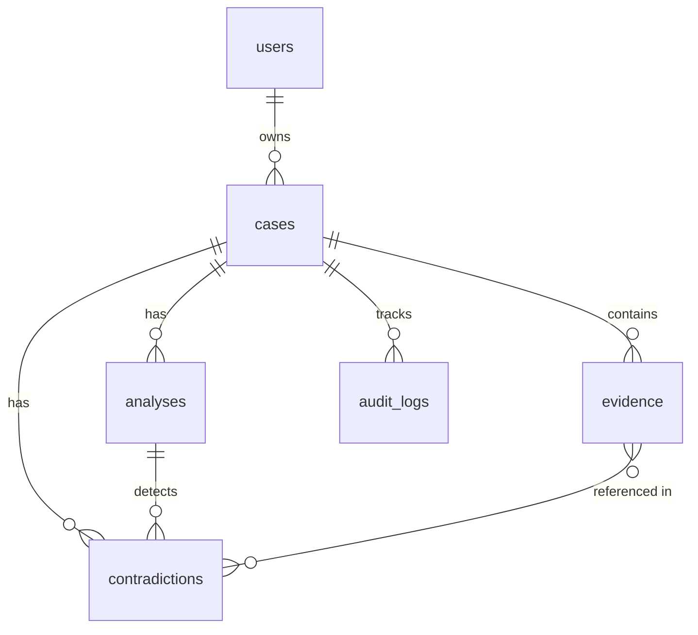

<p align="center">
  
</p>

<p align="center">
  
  
  
  
  
</p>

<h1 align="center">Veridicus</h1>

<p align="center">
  <strong>Autonomous Forensic Reasoning Engine</strong><br/>
  <em>Industrial-scale contradiction detection across multi-modal evidence</em>
</p>

<p align="center">
  <a href="#-the-problem">Problem</a> •
  <a href="#-the-solution">Solution</a> •
  <a href="#-features">Features</a> •
  <a href="#-quick-start">Quick Start</a> •
  <a href="#-architecture">Architecture</a> •
  <a href="#-api-reference">API</a>
</p>

---

## 🎯 The Problem

Forensic investigations drown in data. A single case can involve:

- **10,000+** pages of documents
- **Hundreds** of hours of audio/video
- **Decades** of historical records
- **Multiple** conflicting witness statements

Human analysts spend **months** manually cross-referencing evidence, often missing critical contradictions buried across thousands of exhibits.

---

## 💡 The Solution

**Veridicus** is an AI-powered forensic reasoning platform that:

> 🧠 _"Where human analysts see thousands of pages, Veridicus sees patterns of truth and deception."_

| Capability | How It Works |
|------------|--------------|
| **Context Caching** | Load 1M+ tokens of evidence into Gemini's context cache |
| **Deep Reasoning** | Use `thinking_level: high` to reason through complex contradictions |
| **Real-time Analysis** | Stream audio through Gemini Live for vocal stress detection |
| **Audit Trail** | Immutable logging of every action for legal compliance |

---

## ✨ Features

### 📁 Evidence Vault
Upload and cache forensic evidence with intelligent processing:

```
Supported Formats:
├── 📄 Documents: PDF, DOCX, TXT
├── 🎬 Video: MP4, MOV, AVI
├── 🎵 Audio: MP3, WAV, M4A
└── 🖼️ Images: PNG, JPEG, TIFF
```

- **500MB** max file size
- **Automatic metadata extraction** via Gemini
- **Vector embeddings** for semantic search

### 🧠 Deep Reasoning Engine

Powered by **Gemini 3 Pro** with transparent thinking:

```
┌─────────────────────────────────────────────────────┐
│ USER: "Find contradictions in witness testimony"   │
├─────────────────────────────────────────────────────┤
│ 💭 THINKING:                                        │
│   → Cross-referencing Exhibit A (pg 47) with B...  │
│   → Timeline inconsistency detected: 2:45 PM vs... │
│   → Checking corroborating evidence...             │
├─────────────────────────────────────────────────────┤
│ 🎯 RESULT:                                          │
│   Critical contradiction found between Witness 1   │
│   and Witness 2 regarding vehicle color...         │
│   [Confidence: 94%] [Severity: HIGH]               │
└─────────────────────────────────────────────────────┘
```

### 🎙️ Vibe Forensics

Real-time vocal analysis using **Gemini Live API**:

| Indicator | Detection |
|-----------|-----------|
| 🔴 **Stress** | Vocal micro-tremors, pitch elevation |
| 🟠 **Anxiety** | Speech rate changes, hesitation patterns |
| 🟡 **Cognitive Load** | Complex sentence restructuring |
| ⚪ **Baseline** | Normal speech patterns established |

### 🗺️ Contradiction Map

Visual network of evidence conflicts:

```
 ┌──────────┐                    ┌──────────┐
 │Exhibit A │─── CRITICAL ──────│Exhibit B │
 │ pg. 47   │   "Vehicle was    │ pg. 12   │
 │          │    blue" vs       │          │
 └──────────┘    "red sedan"    └──────────┘
       │                              │
       └────── MEDIUM ───────────────┘
           Timeline mismatch
```

### 📊 Audit Trail

Every action is immutably logged:

- Evidence uploads with checksums
- Analysis queries and responses
- User authentication events
- Data access patterns

---

## 🚀 Quick Start

### Prerequisites

| Requirement | Version | Purpose |
|-------------|---------|---------|
| Node.js | 22+ | Runtime |
| npm | 10+ | Package manager |
| Supabase | - | Database & Auth |
| Google AI API | - | Gemini access |

### One-Command Setup

```bash
# Clone and enter
git clone https://github.com/your-org/veridicus.git && cd veridicus

# Backend
cd backend && npm install && cp .env.example .env
# → Edit .env with your API keys
npm run dev &

# Frontend (new terminal)
cd ../frontend && npm install && cp .env.example .env.local
# → Edit .env.local
npm run dev
```

### Environment Variables

<details>
<summary><strong>Backend (.env)</strong></summary>

```env
# Supabase (Required)
SUPABASE_URL=https://your-project.supabase.co
SUPABASE_ANON_KEY=eyJ...
SUPABASE_SERVICE_ROLE_KEY=eyJ...

# Google AI (Required)
GOOGLE_AI_API_KEY=AIza...

# Server (Optional)
PORT=3001
HOST=0.0.0.0
NODE_ENV=development
```
</details>

<details>
<summary><strong>Frontend (.env.local)</strong></summary>

```env
NEXT_PUBLIC_SUPABASE_URL=https://your-project.supabase.co
NEXT_PUBLIC_SUPABASE_ANON_KEY=eyJ...
NEXT_PUBLIC_API_URL=http://localhost:3001
NEXT_PUBLIC_WS_URL=ws://localhost:3001
```
</details>

### Database Setup

Run in Supabase SQL Editor or via CLI:

```bash
# Option 1: Supabase CLI
supabase db push

# Option 2: Manual (copy from supabase/migrations/001_create_veridicus_schema.sql)
```

**Open [http://localhost:3000](http://localhost:3000)** 🎉

---

## 🏗️ Architecture

```
veridicus/
│
├── 🔧 backend/                 # Fastify API Server
│   ├── src/
│   │   ├── api/               # REST Endpoints
│   │   │   ├── cases.ts       # Investigation CRUD
│   │   │   ├── evidence.ts    # File upload & processing
│   │   │   ├── analysis.ts    # Reasoning queries
│   │   │   ├── analyses.ts    # Analysis history
│   │   │   └── contradictions.ts
│   │   ├── gemini/            # AI Integration
│   │   │   └── gemini-client.ts  # Thinking mode, caching
│   │   ├── websocket/         # Real-time
│   │   │   └── live-audio.ts  # Vibe Forensics
│   │   ├── services/          # Business Logic
│   │   ├── middleware/        # Auth, validation
│   │   └── constants.ts       # Configuration
│   └── package.json
│
├── 🎨 frontend/                # Next.js 16 App
│   ├── app/                   # App Router
│   │   ├── cases/             # Case management
│   │   ├── vault/             # Evidence upload
│   │   ├── reasoning/         # AI chat interface
│   │   ├── vibe/              # Audio analysis
│   │   ├── timeline/          # Chronological view
│   │   └── contradictions/    # Conflict map
│   ├── components/            # UI Components
│   ├── lib/                   # Utilities
│   │   ├── api-schemas.ts     # Zod validation
│   │   └── audio-streaming.ts # WebSocket client
│   └── store/                 # Zustand state
│
├── 📦 shared/                  # Shared Code
│   ├── types/
│   │   └── database.ts        # Single source of truth
│   └── utils/
│       └── validation.ts      # UUID, email validation
│
└── 🗄️ supabase/
    └── migrations/            # SQL schema
```

---

## 🛠️ Tech Stack

| Layer | Technology | Why |
|-------|------------|-----|
| **Frontend** | Next.js 16, React 19 | App Router, Server Components |
| **Styling** | TailwindCSS 4, Framer Motion | Rapid UI, fluid animations |
| **State** | Zustand, TanStack Query | Simple stores, smart caching |
| **Backend** | Fastify 5, TypeScript 5 | Fastest Node.js framework |
| **AI** | Gemini 3 Pro/Flash/Live | Deep reasoning, streaming |
| **Database** | Supabase (PostgreSQL) | RLS, realtime, storage |
| **Vectors** | pgvector | Semantic evidence search |
| **Validation** | Zod | Runtime type checking |

---

## 📡 API Reference

### Authentication

All endpoints require Supabase JWT:

```http
Authorization: Bearer <access_token>
```

### REST Endpoints

<details>
<summary><strong>Cases</strong></summary>

| Method | Endpoint | Description |
|--------|----------|-------------|
| `GET` | `/api/cases` | List user's cases |
| `GET` | `/api/cases/:id` | Get case with evidence |
| `POST` | `/api/cases` | Create case |
| `DELETE` | `/api/cases/:id` | Delete case |

```bash
# Example: Create case
curl -X POST http://localhost:3001/api/cases \
  -H "Authorization: Bearer $TOKEN" \
  -H "Content-Type: application/json" \
  -d '{"name": "Project Alpha", "description": "Investigation"}'
```
</details>

<details>
<summary><strong>Evidence</strong></summary>

| Method | Endpoint | Description |
|--------|----------|-------------|
| `GET` | `/api/evidence/case/:caseId` | List evidence |
| `POST` | `/api/evidence/upload?caseId=:id` | Upload file |
| `POST` | `/api/evidence/:id/process` | Trigger AI analysis |

```bash
# Example: Upload evidence
curl -X POST "http://localhost:3001/api/evidence/upload?caseId=$CASE_ID" \
  -H "Authorization: Bearer $TOKEN" \
  -F "file=@document.pdf"
```
</details>

<details>
<summary><strong>Analysis</strong></summary>

| Method | Endpoint | Description |
|--------|----------|-------------|
| `POST` | `/api/analysis/query` | Run reasoning |
| `GET` | `/api/analyses/case/:caseId` | Get history |

```bash
# Example: Query the engine
curl -X POST http://localhost:3001/api/analysis/query \
  -H "Authorization: Bearer $TOKEN" \
  -H "Content-Type: application/json" \
  -d '{"caseId": "uuid", "query": "Find timeline contradictions"}'
```
</details>

<details>
<summary><strong>WebSocket (Vibe Forensics)</strong></summary>

```javascript
// Connect
const ws = new WebSocket('ws://localhost:3001/ws/vibe');

// Authenticate (first message)
ws.send(JSON.stringify({
  type: 'auth',
  token: 'access_token',
  caseId: 'uuid'
}));

// Send audio chunks
ws.send(JSON.stringify({
  type: 'audio',
  audio: 'base64_pcm_data'
}));

// Receive insights
ws.onmessage = (event) => {
  const insight = JSON.parse(event.data);
  // { type: 'affect', text: '...', confidence: 0.87, indicator: 'stress' }
};
```
</details>

---

## 🗄️ Database Schema



| Table | Description | RLS |
|-------|-------------|-----|
| `cases` | Investigation units | Owner only |
| `evidence` | Files with metadata | Via case ownership |
| `analyses` | Reasoning sessions | Via case ownership |
| `contradictions` | Detected conflicts | Via case ownership |
| `audit_logs` | Action history | Read-only via case |

---

## 🔒 Security

| Feature | Implementation |
|---------|----------------|
| **Authentication** | Supabase JWT + middleware validation |
| **Authorization** | Row Level Security on all tables |
| **WebSocket Auth** | Token in first message (not URL) |
| **Input Validation** | Zod schemas + UUID regex |
| **File Limits** | 500MB max, type validation |
| **Rate Limiting** | WebSocket: 10 msg/sec |
| **Audit Trail** | Immutable logs with timestamps |

---

## 🐛 Troubleshooting

<details>
<summary><strong>Backend won't start</strong></summary>

```bash
# Check environment variables are set
node -e "console.log(process.env.SUPABASE_URL)"

# Verify Supabase connection
curl https://your-project.supabase.co/rest/v1/ \
  -H "apikey: your_anon_key"
```
</details>

<details>
<summary><strong>WebSocket connection fails</strong></summary>

- Ensure backend is running on correct port
- Check CORS settings in `backend/src/index.ts`
- Verify token is valid (not expired)
</details>

<details>
<summary><strong>Gemini API errors</strong></summary>

- Verify `GOOGLE_AI_API_KEY` is correct
- Check API quota in Google Cloud Console
- Ensure Gemini 3 models are available in your region
</details>

<details>
<summary><strong>Database RLS blocking queries</strong></summary>

- Backend uses service role key (bypasses RLS)
- Frontend uses anon key (respects RLS)
- Check that policies exist: `SELECT * FROM pg_policies`
</details>

---

## 📊 Performance

| Metric | Value |
|--------|-------|
| **Context Cache** | Up to 1M tokens |
| **Max File Size** | 500MB |
| **Audio Latency** | ~100-200ms |
| **Reasoning** | 5-30s depending on complexity |
| **WebSocket Rate** | 10 messages/second |

---

## 🧪 Testing

```bash
# Backend
cd backend
npm run test          # Unit tests (vitest)
npm run lint          # ESLint

# Frontend
cd frontend
npm run lint          # ESLint
npx playwright test   # E2E tests
```

---

## 🎨 Design System

| Token | Value | Usage |
|-------|-------|-------|
| `--ocean` | `#2c365a` | Primary, text, buttons |
| `--cream` | `#eee8df` | Background |
| `--beige` | `#c4bcb0` | Borders, muted |

**Typography:**
- **Sans**: Inter (body text)
- **Serif**: Playfair Display (headings)

---

## 🤝 Contributing

```bash
# 1. Fork the repo
# 2. Create feature branch
git checkout -b feature/amazing-feature

# 3. Make changes and test
npm run lint && npm run test

# 4. Commit with conventional commits
git commit -m "feat: add amazing feature"

# 5. Push and create PR
git push origin feature/amazing-feature
```

---

## 📜 License

MIT License - See [LICENSE](./LICENSE)

---

<p align="center">
  <strong>Built with 🧠 for truth-seekers</strong><br/>
  <sub>Powered by Google Gemini 3</sub>
</p>
